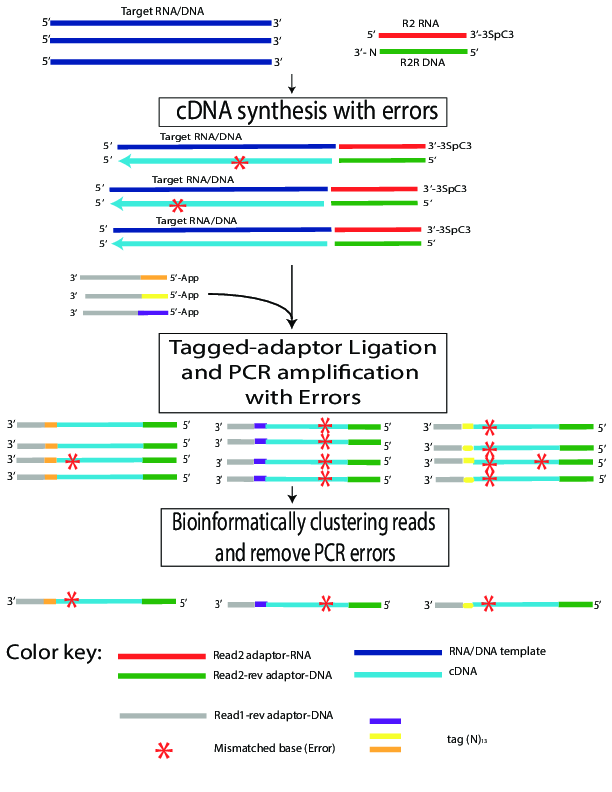

This is a note for myself on the tag-based error correction program that I coded up (Figure 1). This is inspired from a combination of two works, [circ-seq](http://www.ncbi.nlm.nih.gov/pubmed/24243955) and [safe-seq](http://www.pnas.org/content/108/23/9530).



# Indexed R1R #

For a given read 1, the first 13 bases is the index as below.

<center>
CGA TG[N NNN NNN NNN NNN] TCT GAA CTC CAG TCA CAC TGA TAT CTC GTA TGC CGT CTT CTG CTT GAA AAA AAA AAGG GGG G
</center>

Reads with same index are grouped together in a dictionary (python).


# Concensus base #

For a cluster of reads (group), bases at a single position (a column) were extracted, concensus base was predicted using maximum likelihood with priors as Phred quality scores (Q):

\[
Q = -10 log_{10} P_e
\]
\[
P_e = 10 ^{\frac{-Q}{10}}
\]
where $P_e$ is the error probability.

For a give position in the read cluster $J$, read $i$, likelihood of identity of the concensus base ($I$) being $b$ given output base ($r$): 
\[ P(I=b | r_{i, j},Q_{i,j}) \propto \left\{ \begin{array}{cl}
         1 - 10^\frac{-Q_{i,j}}{10} & \mbox{if $r_{i,j} = b$};\\
        10^\frac{-Q_{i,j}}{10} & \mbox{if $r_{i,j} \neq b$}.\end{array} \right.
\]

\[
P(I=b | r_{j},Q_{j}) = \frac{\prod_i (P(I=b|r_{i, j},Q_{i, j}))}{\sum_{d \in \{A,C,T,G\}}\prod_i (P(I=d|r_{i, j},Q_{i, j}))}
\]

For the following example illutrated with **R**, if a position in a read cluster contains bad sequencing reads [T,A,A,A,A] with Phred scores [7,-,-,-,-]:

```{r warning = F, message = F }
library(cowplot)

q <- c('7','-','-','-','-')
q <- sapply(q,utf8ToInt) - 33
b <- c('T','A','A','A','A')

phred2prob <- function(q){
  return (10 ^ (-q / 10))
}

getPosterior <- function(Ibase, b, q){
  qHit <- q[b==Ibase]
  qMiss <- q[b!=Ibase]
  hitProb <- prod(1 - phred2prob(qHit))
  missProb <- prod(phred2prob(qMiss)/3) 
  return (hitProb * missProb)
}

bases <- c('A','T','C','G')
posteriors <- sapply(bases, getPosterior, b, q)
posteriorsDist <- posteriors/sum(posteriors)
qplot(bases, posteriorsDist) + 
  geom_bar(stat='identity') +
  labs(x = ' ', y = 'Posterior Probability')
```

# Maximum likelihood #
We will take the base with highest posterior probability as the concensus base, with a quality score (Q):
\[
Q = -10log_{10} (1 - P(I=C | r_{j},Q_{j}))
\]

```{r, echo =F }
Quality = - 10 * log10(1 - posteriorsDist[bases=='A']) 
```

In the above example, uncorrected quality score would be `r Quality`.

# Correcting base calling quality #

As Illumina produce phred33 for base calling quality fastq files, we need to scale Q score back to the range of [0,40].

In python, it would be:

```
minQ = 33
maxQ = 73
quality = -10 * np.log10(1 - posterior) + 33 if posterior < 1 else maxQ
quality[quality<minQ] = minQ
quality[quality<maxQ] = maxQ
```

The corrected score for the above sample of a read base *C* would be: **`r intToUtf8(as.integer(Quality)+33)` **


